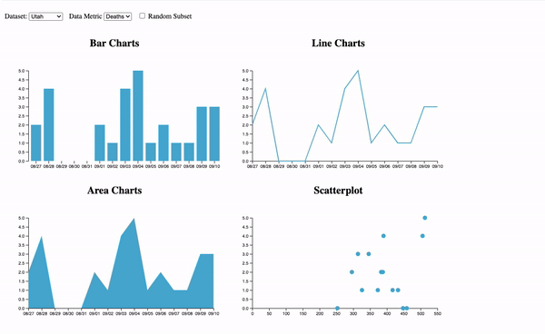

# DataVisualizations
Where I utilized JavaScript and D3 to create polished visualizations that convey the nuance in a variety of datasets.

## CovidDataCharts Demo
Here is a demo of how the interactions look. You can also check out a higher resolution version [here](figures/hw3_demo.mov).

