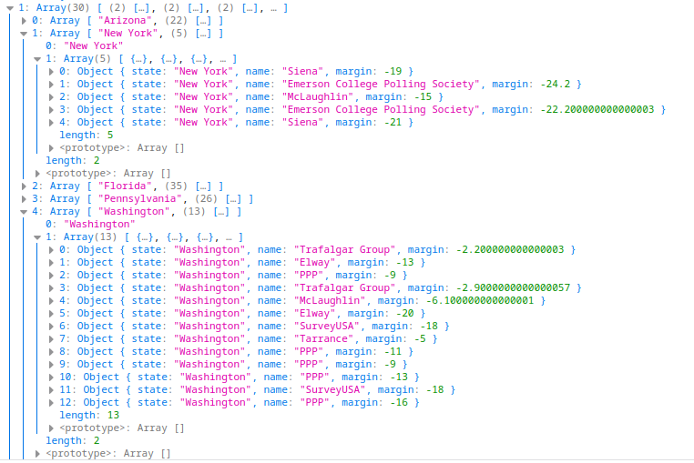
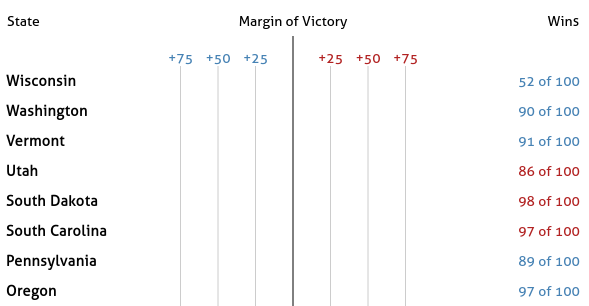
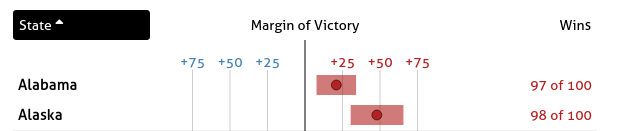
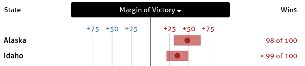
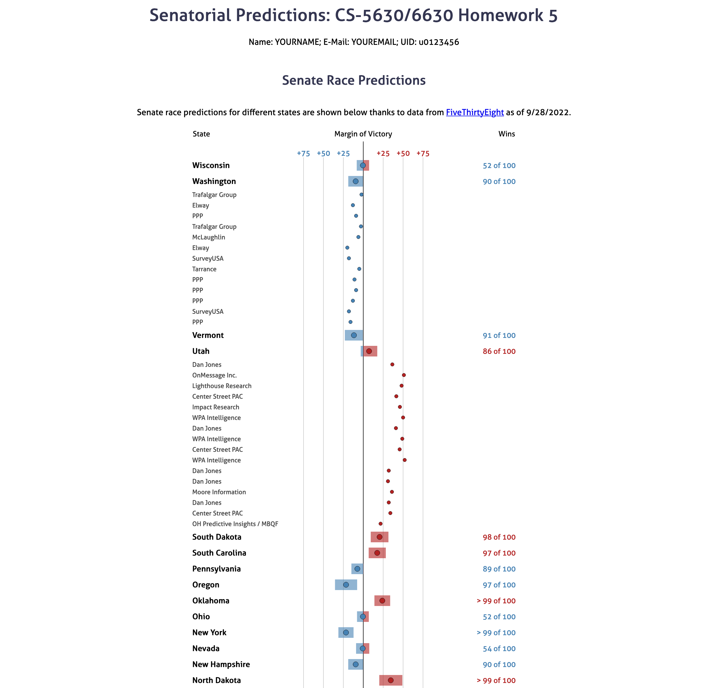
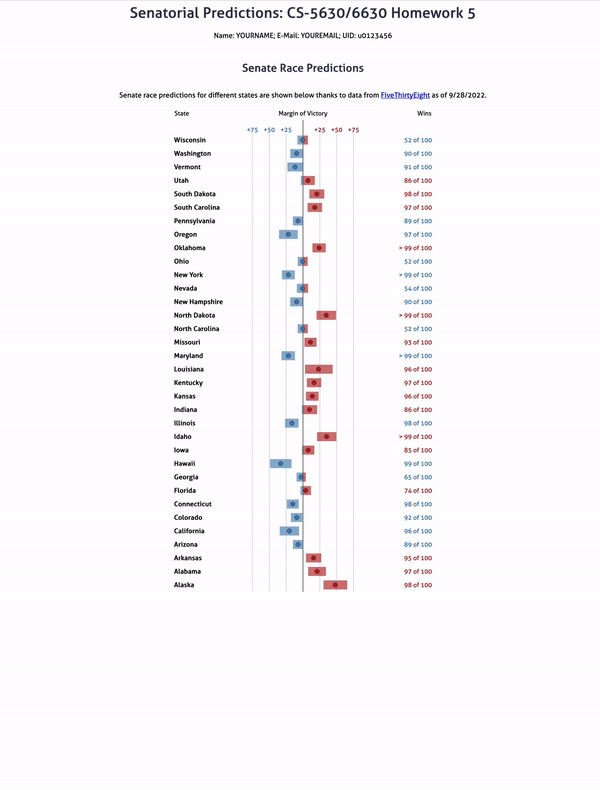

# Senate Predictions
## Wrangling the Data
We provide code that loads the data for you from `senate_polls.json` and `senate_forecasts.csv`. `senate_forecasts.csv` has many different data fields, we will only use a few of them.

The relevant columns in `senate_forecasts.csv` are : 

Column | Description
-------|------------
`state` | Name of the state
`winner_Dparty` | Chance the democrat will win the state
`winner_Rparty` | Chance the republican will win the state
`mean_netpartymargin`, `p90_netpartymargin`, `p10_netpartymargin` | Forecasted margin, including the upper and lower bounds of an 80% confidence interval

Please note, that we have cut 1 senate race for the simplicity of the visualization and interaction. In Oklahoma, there are 2 races, but it would be tricky to join across tables by just the state name with that data. We decided to cut the race between Kendra Horn, Markwayne Mullin.

The relevant columns in `senate_polls.csv` are *(from the FiveThirtyEight Readme):*

Column | Description
-------|------------
`state` | Name of the state
`pollster` | Name of organization that conducted the poll.
`poll_id` | ID for a given poll. (responses for each candidate is on a separate row, so this attribute links them together.)
`question_id` | ID for a given question.  (needed to distinguish between multiple questions on the same poll)
`pct` | the polled prediction for the given candidate.
`party` | the party chosen in the poll (e.g. democrat or republican)

If you are going to attempt the extra credit you need to load `senate_polls.csv` and group by the `state` and `poll_id` in order to get a list of polls for each state. Your final structure should be something like the following:

That is, it should be a [Map](https://developer.mozilla.org/en-US/docs/Web/JavaScript/Reference/Global_Objects/Map) object where the keys are the states, and the values are an array of polls. Notice, that each poll is condensed into a single element where we store the `name` of the `pollster`, the `state` (for convenience later), and calculate the `margin` as the difference in `pct` between republicans and democrats. If you do not change the code in `script.js` you will get a structure like this.

We recommend completing the other parts of the assignment first, and only to attempt the extra credit once they are working, as it will be easier to confirm if you are wrangling the data correctly.

You can do this aggregation in any way that you want, but we strongly suggest looking at [d3.rollup](https://github.com/d3/d3-array/blob/v3.2.0/README.md#rollup) for d3 version 7. This makes it possible to do this combining/aggregation in a very succinct way. 

## Part I: Populating The table

We provide a decent amount of code for this assignment. Even though we provide everything needed in the constructor of the `Table` class, you should read through this set-up code so you are familiar with class variables you can use in other functions (such as `this.scaleX`).

In addition, we provide most of the structure in the `drawTable` function, and call it for you from the `script.js` file. However, you still need to add some code here to start seeing parts of the table appear.

You will use the `forecastSelection` variable to populate the text cells of the table. This will be done in two steps. First, filter the selection to only include the cells of type `text`, then simply set the text based on the data. The important thing to trace through at this point is what is contained in the data element. Since we are transforming the data in these calls to `selection.data` this can be a bit tricky, but the place to look carefully is the `rowToCellDataTransform` function. After you understand that flow, it will only take a small amount of code to filter the selection based on the data. Notice that we can use a [d3.selection.filter](https://github.com/d3/d3-selection/blob/v2.0.0/README.md#selection_filter) here, which is not to be confused with vanilla JS filter functions.

At the end of this step your table should look like the following:

## Part II: I am Legend

Next add the legend in the Margin of Victory column. The HTML has already been pre-populated with an SVG container here. Simply select the SVG with id `marginAxis`, set the width and height, add a line in the middle, and add labels for the gridlines.

At the end of this step your table should look like this:

## Part III: Add Gridlines
Next add gridlines to each SVG in the “Margin of Victory” column. To do this you can add code to the `addGridlines` function. We already call this function in `drawTable`, where we pass in the selection that contains the list of group elements – One group per SVG. The `ticks` variable holds the values that the gridlines should pass through. After this step you should get:

## Part IV: Add Bars
Next we will implement the bars showing the confidence interval. Update `addRectangles` using a similar `containerSelect` variable. Notice that in cases where a margin range crosses the center line you will need two rectangles as opposed to just one, as you want two different colors for the parts left and right of the center line. You should trace through the existing code to see what data is bound to this selection. Ultimately this range should refer back to `margin_lo` and `margin_hi` in `forecast.csv`. The result should look like this: 

## Part V: Add Dots
Finally we finish the state-wise predictions chart with a dot to represent the `margin` attribute by writing code in the `addCircles` function. Notice how the dots are colored based on who is predicted to win, similar to the bar charts.

## Part VI: Add Sorting Functionality

Next we will add the ability to sort based on any column by clicking the column headers.
* In `attachSortHandlers` add a click handler for each `th` element inside the row with id `columnHeaders`.
* In the actual event handler you should sort the the array `this.tableData` based on the column you selected.
    * State – sort alphabetically.
    * Margin of Victory – sort by the absolute value of the `margin` attribute.
* Selecting a column more than once should toggle the sorting between ascending and descending.

*Hint*: using `this.headerData` may help you keep track of the current sorting state.

At the end of these steps the rows should be sorting when you select different columns. See the video below for a demonstration.

## Part VII: Update Headers Based on Sorting

It is good practice to make the current state of the sorting obvious in the UI. Here, it should be clear which column is driving the sorting and whether it is sorted by ascending order or descending order. We will use a black background color for the column that is driving the sorting, and an arrow icon do indicate the direction.

For example in this screenshot values are being sorted in increasing order by state name: 

Here, the table is sorted in decreasing order by the margin of victory:

We suggest the following approach:
* add a `sorting` class to the `th` element that is used for sorting. This class is already defined in `styles.css` to have the black background and white text.
* Notice the `i` elements in the html file. These are pulling icons from [font-awesome](https://fontawesome.com/). They all also start with the class `no-display` This class prevents the icon from being displayed. When you want to show an actual icon, remove the `no-display` class from the `i` tag. To get the correct tag you need to make sure the `fa-<iconkey>` is set correctly. For example, here we are using `fa-sort-up` for ascending and `fa-sort-down` for descending icons. Feel free to pick different icons from their [gallery](https://fontawesome.com/icons?d=gallery) as long as they make sense. The important things is to only have one of these classes applied at a time.

## Part VIII: Polling contributions

The final step is to incorporate the polling data into this chart. Specifically, we want to be able to select a state and see all of the polls for that state displayed under it in the table. We have already attached the click handler so that `toggleRow` will be called each time a state row is clicked.

Please note, there are some states without any polling. Those are: Oregon, North Dakota, Idaho, Hawaii, California, and Alabama.

In this function you will need to either expand or collapse the row, based on it's current state. You will have to either add or remove all of the polls that correspond to the state that was clicked from `this.tableData`. After `this.tableData` is updated you must call `drawTable` again.

Now that `this.tableData` could include both aggregate state predictions and individual polls you will have to go back and make a few updates. Specifically:
* `addRectangles` **should not add any rectangles** for the individual polls, even if they are not visible in the plot.
* `addCircles` should distinguish the circles plotted for state aggregates from individual polls by making these circles smaller.

In the following example you can see both Utah and Washington expanded.

## DONE! 

Your final solution should behave something like this ([full resolution download](figs/demo.mp4)):

